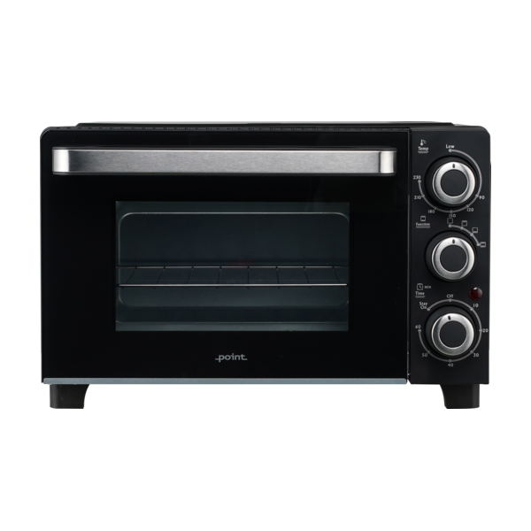
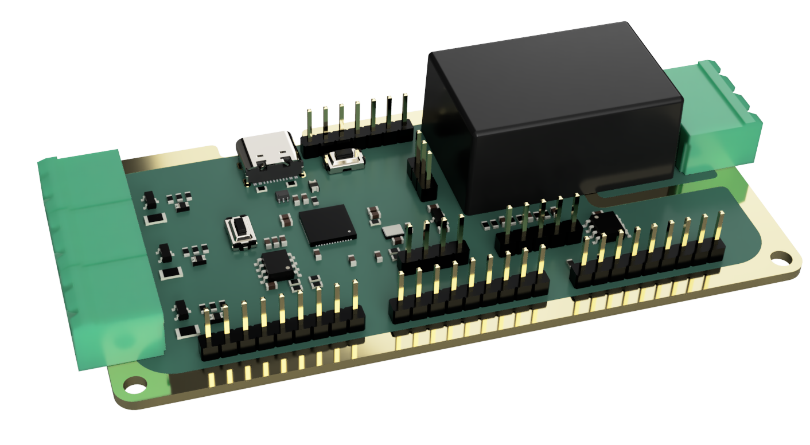

# Reflow Controller

This is my own take at building my own reflow oven. This repo will contain all the documentation, code and hardware design files.

## Oven

As there are no easily available small oven here in Norway for a reasonable price, I settled on the [Point PMO16BL](https://www.power.no/kjoekkenmaskiner/kjoekkenapparater/miniovn-og-frittstaaende-platetopp/point-pmo16bl-miniovn/p-1136808/) from Power, a Norwegian electronics store. It's a 16L oven with a max temperature of 230°C. However I do believe we can get it to go higher than that.

Through coupons and discounts I managed to get one brand new from a store for as little as 291 NOK, which as of now (2023-05-14) is about 20.54 USD.

## Controller

The controller itself is designed to be as simple as possible and have to navigate around the still ongoing chip shortage. It features an RP2040 microcontroller, a 1.28" circular LCD display, a button, and the option for a rotary encoder as well as up to 3 thermocouple inputs and 3 relays for controlling the oven.

However, it is not capable of receiving the thermocouples straight in, even though it would have been more practical. This is due to the chips chosen were not available on their own, but only as a breakout board. So to save time and effort, I decided against simply moving the chips over to a main board, and instead just use the breakout boards as is. An advantage of this approach, is the potential for a solderless experience if more thermocouples are needed in the future.

The controller will also feature an onboard EEPROM for storing the heat profiles and settings as well as a USB-C connector for programming. The board can be powered directly from mains through a large plug in connector.

## Software

## License
This project is licensed under the CERN Open Hardware Licence v2 - Strong Reciprocity (CERN-OHL-S-2.0). See [LICENSE](./LICENSE) for more information.
